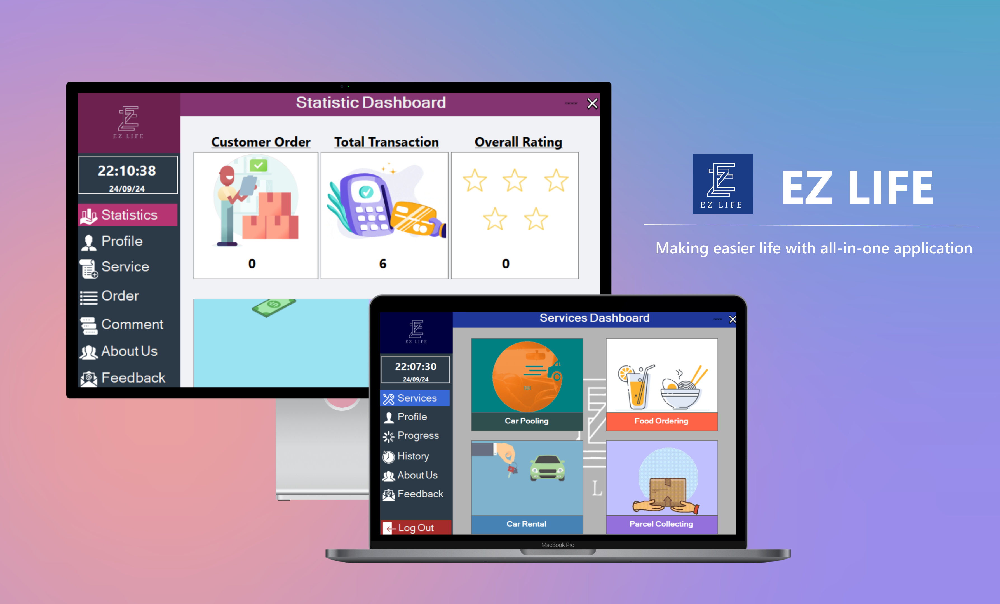

# OMC_EZLIFE_May2023

> Team Project for `Oh My Code! (OMC) Competition May 2023` in [*Universiti Teknologi PETRONAS*](https://www.utp.edu.my/Pages/Home.aspx).

### Overview

**EZLIFE** is an **desktop windows form application** aimed to aim to streamlined user experience by compounding car rental, food ordering, parcel collecting and car pooling services into one.

It is a `UTP Services Gathering Application` that will serve as a comprehensive directory of available services, allowing users to effortlessly explore their options. 

Additionally, the application will enable users to submit service requests, track the status of their submissions in real-time, and even provide valuable feedback on their service experiences. 

---
### Technologies involved
- Visual Basic (.NET)
- Microsoft Access
- Structure Query Language (SQL)

---
### Achievement
- Obtaining `Rising Star Award` among nearly 30 teams in May 2023 batch.